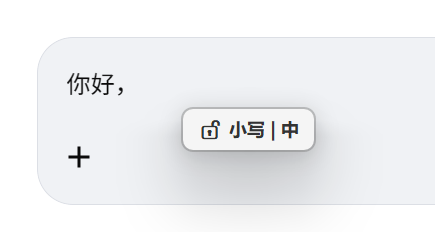
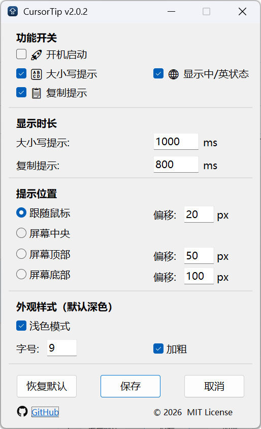

# CursorTip

轻量级桌面状态提示工具，在光标旁即时显示键盘和剪贴板状态。

## 解决的痛点

### 键盘状态盲区
很多笔记本/机械键盘没有 CapsLock 指示灯，或者灯在角落看不清。切换大小写后经常盲打，输了才发现错了，得删除重输。

### 输入法状态混乱
Windows 输入法状态栏有时不显示或位置不明显。切换窗口后输入法状态可能变化，打字时才发现是错的模式。

### 复制操作无反馈
Ctrl+C 没有任何提示，不确定是否复制成功，也不知道复制了多少内容，要粘贴确认才知道。

**核心价值**：给"盲操作"提供即时视觉反馈，减少误操作和重复确认的时间。

## 功能

| 功能 | 触发方式 | 显示内容 |
|:-----|:---------|:---------|
| 大小写 + 输入法 | CapsLock 切换 / Shift 释放 | 🔒 大写 \| 中 / 🔓 小写 \| 英 |
| 复制提示 | 剪贴板变化 | 已复制：N 字符 / 图片 / N 个文件 |
| 设置窗口 | 右键托盘图标 | 功能开关、显示时长、提示位置、外观样式 |

### 复制检测逻辑说明

| 复制方式 | 检测结果 | 说明 |
|:---------|:---------|:-----|
| 复制文本 | N 字符 | 任意文本内容 |
| 截图 (Win+Shift+S) | 图片 | 系统截图工具 |
| 画图/PS/微信复制图片 | 图片 | 图片编辑软件复制的图片内容 |
| 文件管理器复制图片文件 | N 个文件 | 复制的是图片**文件**，不是图片内容 |
| 文件管理器复制任意文件 | N 个文件 | 复制的是文件 |

## 下载安装

1. 前往 [Releases](https://github.com/zeno528/CapsCopyTip/releases) 页面
2. 下载最新版 `CursorTip_vX.X.X.exe`
3. 双击运行即可，**无需安装 AutoHotkey**
4. 开机自启：右键托盘图标 → 设置 → 勾选「开机启动」，或手动将 exe 放入启动文件夹（Win+R 输入 `shell:startup`）

## 效果展示

提示会在鼠标位置附近显示，自动消失。

| 大小写 + 输入法提示 | 复制提示 | 设置界面 |
|:-------------------:|:--------:|:--------:|
|  |  |  |

## 系统要求

- Windows 10/11
- 无需安装 AutoHotkey（exe 独立运行）
