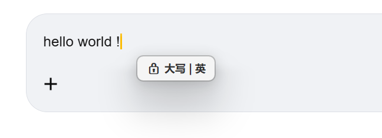
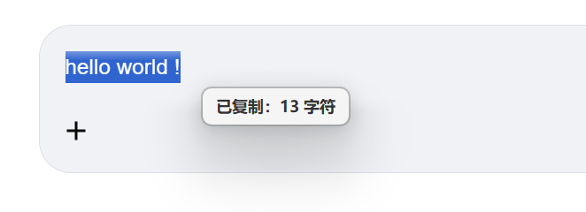
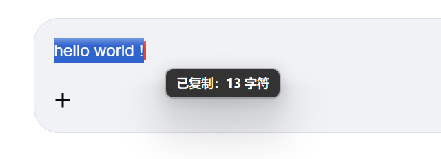

<div align="center">


# CursorTip

**轻量 · Windows 桌面状态提示工具** · [了解更多](https://cursortip-website.pages.dev/)

在屏幕上实时显示键盘大小写 + 输入法提示和剪贴板操作反馈，帮助你准确感知输入环境。

[](https://github.com/zeno528/CursorTip/releases)
[](LICENSE)
[](https://cursortip-website.pages.dev/)
[](https://www.autohotkey.com/)
[](https://github.com/zeno528/CursorTip)

简体中文 | [English](README_EN.md)

</div>

## 效果展示

| 大小写 + 输入法提示 | 复制提示 |
|:-------------------:|:--------:|
|  |  |

## 功能

| 功能 | 触发方式 | 提示内容 |
|:-----|:---------|:---------|
| 大小写状态 | CapsLock 切换 / Shift 释放 ，可独立显示| 🔒 大写 / 🔓 小写 |
| 输入法状态 | 随大小写提示一同显示 | 中 / 英 |
| 复制反馈 | 剪贴板内容变化 | 已复制：N 字符 / 图片 / N 张图片 / N 个文件 |

提示以浮动气泡形式出现在屏幕上，可跟随鼠标位置，自动消失，不打断当前操作。提示外观支持 **浅色 / 深色主题**，可跟随系统自动切换，也能在设置里手动选择。

## 复制检测

| 复制方式 | 检测结果 |
|:---------|:---------|
| 文本 | N 字符 |
| 截图 (Win+Shift+S) | 图片 |
| 画图 / PS / 微信复制图片 | 图片 |
| 文件管理器复制图片文件 | N 张图片 |
| 文件管理器复制其他文件 | N 个文件 |

复制图片文件时按扩展名识别，支持：`png / jpg / jpeg / gif / bmp / webp / ico / cur / svg / tif / tiff / heic / heif / avif / jfif / jpe / dib`

## 安装

1. 前往 [Releases](https://github.com/zeno528/CursorTip/releases) 下载最新版 `CursorTip_vX.X.X.zip`
2. 双击运行，无需安装 AutoHotkey

### 开机自启

右键托盘图标 → 设置 → 勾选「开机启动」，或将 exe 放入启动文件夹（`Win+R` 输入 `shell:startup`）

## 编译

需要 [AutoHotkey v2](https://www.autohotkey.com/) 和 Ahk2Exe 编译器（v2 安装包自带）。

```bash
"C:\Program Files\AutoHotkey\Compiler\Ahk2Exe.exe" \
  /in CursorTip.ahk \
  /out CursorTip.exe \
  /base "C:\Program Files\AutoHotkey\v2\AutoHotkey64.exe"
```

脚本内置 `;@Ahk2Exe-SetMainIcon` 指令指定图标，无需命令行传入。

## 系统要求

- Windows 10 / 11

## 项目结构

```
CursorTip/
├── CursorTip.ahk               # 主脚本（所有开发与 Bug 修复均针对此文件）
├── LICENSE                     # MIT 许可证
├── README.md / README_EN.md    # 中英文说明
│
├── assets/                     # 图标与品牌资源
├── images/                     # README 预览图
└── docs/                       # AHK v2 开发文档
```

## 许可证

[MIT](LICENSE)
