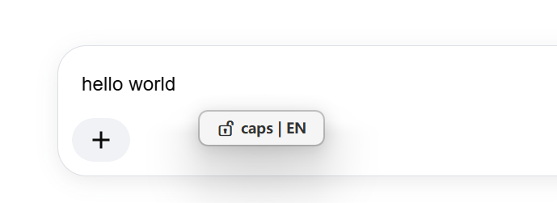
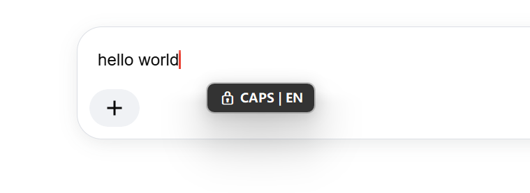
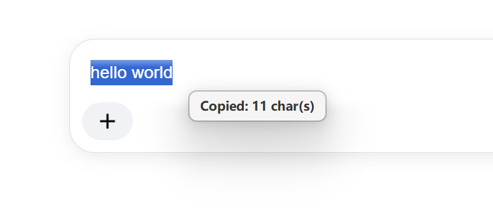
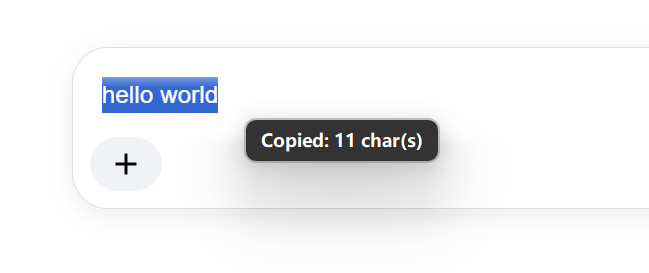

<div align="center">


# CursorTip

**A lightweight Windows desktop status indicator** · [Learn more](https://cursortip.pages.dev/)

Displays real-time caps lock + IME state and clipboard operation feedback on screen, helping you stay aware of your input environment.

[](https://github.com/zeno528/CursorTip/releases)
[](LICENSE)
[](https://cursortip.pages.dev/)
[](https://www.autohotkey.com/)
[](https://github.com/zeno528/CursorTip)

English | [简体中文](README.md)

</div>

## Screenshots

| Caps Lock + IME | Copy Feedback |
|:----------------:|:-------------:|
|  |  |

## Features

| Feature | Trigger | Display |
|:--------|:--------|:--------|
| Caps Lock state | CapsLock toggle / Shift release, independently displayed | 🔒 CAPS / 🔓 caps |
| IME state | Shown with caps lock indicator | ZH / EN |
| Copy feedback | Clipboard content changes | Copied: N char(s) / image / N file(s) |

Tips appear as floating bubbles on screen, can follow the mouse cursor, and auto-dismiss after a few seconds without interrupting your workflow.

## Copy Detection

| Copy Method | Detection Result |
|:------------|:-----------------|
| Text | N chars |
| Screenshot (Win+Shift+S) | Image |
| Paint / PS / WeChat copy image | Image |
| File Explorer copy files | N files |

## Installation

1. Download the latest `CursorTip_vX.X.X.zip` from [Releases](https://github.com/zeno528/CursorTip/releases)
2. Extract and run the exe, no need to install AutoHotkey

### Auto-start on Boot

Right-click the tray icon → Settings → Check "🚀 Run at startup", or place the exe in the startup folder (`Win+R` → `shell:startup`)

## Compilation

Requires [AutoHotkey v2](https://www.autohotkey.com/) and the Ahk2Exe compiler (bundled with the v2 installer).

```bash
"C:\Program Files\AutoHotkey\Compiler\Ahk2Exe.exe" \
  /in CursorTip.ahk \
  /out CursorTip.exe \
  /base "C:\Program Files\AutoHotkey\v2\AutoHotkey64.exe"
```

The script embeds the `;@Ahk2Exe-SetMainIcon` directive to set the icon, so no `/icon` parameter is needed.

## System Requirements

- Windows 10 / 11

## Project Structure

```
CursorTip/
├── CursorTip.ahk               # Main script (all development and bug fixes target this file)
├── LICENSE                     # MIT License
├── README.md / README_EN.md    # Chinese / English documentation
│
├── assets/                     # Icons and brand assets
├── images/                     # README preview images
└── docs/                       # AHK v2 development documentation
```

## License

[MIT](LICENSE)
